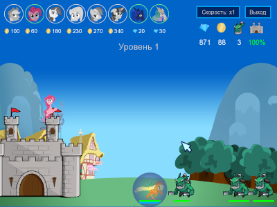

# Игра в стиле Защита замка с персонажами MyLittlePony:Friendship is Magic

[](https://yoomoney.ru/to/41001497003495)
[](https://boosty.to/ponygames)
[](https://tav-developer.itch.io)
[](#)
[](#)
[](#)

## О проекте

Задача игры - на каждом уровне не дать врагам разрушить вашу крепость,
призывая за золото и алмазы пони, которые атакуют врагов или обеспечивают
иную поддержку. Золото начисляется автоматически каждую секунду, алмазы
начисляются за уничтожение врагов и переносятся между уровнями.
Также за алмазы можно заказать между уровнями повышение уровня каждой пони
или дополнительные улучшения для пони.

 

Проект разработан на основе моего движка [GameStudyJS](https://github.com/tereshenkovav/GameStudyJS),
логика игры реализована на JavaScript в рамках движка.
в качестве графической библиотеки используется [SFML](https://www.sfml-dev.org).

## Состав репозитория

* `bin` - каталог для вывода собранного исполнимого файла, а также динамические библиотеки SFML, необходимые для запуска проекта под Windows
* `build` - cкрипты сборки игры для Windows и Linux без использования QtCreator
* `data` - каталог контента игры (графика, звуки, тексты, уровни)
* `GameStudyJS-core` - субмодуль той части движка GameStudyJS, которую использует проект
* `graphics` - иконки игры для дистрибутива и AppImage
* `setup` - скрипты создания дистрибутивов/архивов для Windows, и AppImage для Linux
* `SFML-2.5.1-mingw` - заголовочные и библиотечные файлы библиотеки SFML для сборки проекта под Windows
* `PonyDefendCastleGame` - исходный код игры в виде проекта на С++/Qt для QtCreator

## Инструменты сборки

Для сборки проекта нужен установленный Qt вместе с MinGW для Windows или gcc под Linux
(проверено на версии Qt 5.14.1).
При сборке под Linux, также нужно установить SFML и библиотеки его разработки
(пакеты `libsfml` и `libsfml-dev`). Для сборки под Windows, необходимые библиотеки и заголовочные файлы
уже включены в репозиторий.

Создание дистрибутива для Windows выполняется с помощью программы
[NSIS](https://nsis.sourceforge.io)

Создание архива для Windows выполняется с помощью скриптовой утилиты построения архивов
[SmartZipBuilder](https://github.com/tereshenkovav/SmartZipBuilder)

Для создания AppImage под Linux необходим инструмент сборки AppImageKit - 
[appimagetool-x86_64.AppImage](https://github.com/AppImage/AppImageKit/releases)

## Сборка, запуск игры и создание дистрибутивов

### Сборка

После получения файлов репозитория, нужно обновить субмодуль движка `GameStudyJS-core`,
выполнив в каталоге проекта команды

```
git submodule init
git submodule update

```
Для сборки проекта при помощи QtCreator нужно открыть проект
`PonyDefendCastleGame\PonyDefendCastleGame.pro` и выполнить его сборку в конфигурации Release.
В каталоге `bin` появится исполняемый файл `PonyDefendCastleGame.exe` для Windows
или `PonyDefendCastleGame` для Linux.

Для сборки проекта без QtCreator нужно открыть каталог
`build` и запустить файл `make_linux.sh` для Linux или `make_win32.bat` для Windows.
Результат должен быть аналогичен сборке из IDE.
При работе под Windows может потребоваться изменить путь к файлу `qmake.exe`
в скрипте `make_win32.bat`

### Запуск

Чтобы запустить версию для Windows, вне зависимости от способа сборки,
может потребоваться скопировать в каталог `bin` библиотечные файлы из каталогов Qt.

* `libgcc_s_dw2-1.dll`
* `libstdc++-6.dll`
* `libwinpthread-1.dll`
* `Qt5Core.dll`
* `Qt5Script.dll`

Версия для Linux запускается без дополнительного копирования файлов.

### Создание дистрибутивов

**ВАЖНО**: при создании дистрибутивов, информация о версии, ветке и коммите берется
из репозитория git, поэтому все описанные ниже команды будут работать корректно
только при вызове из каталога-репозитория git и при наличии установленного git.

Создание архива и дистрибутива для Windows выполняется
после сборки проекта запуском файла `build32.bat`
из каталога `setup/windows`\
В скрипте сборки нужно указать путь к компилятору NSIS.\
Также в скрипте нужно задать правильное значение переменной `QTDIR` - указав
каталог, где находятся библиотеки Qt.

Создание AppImage для Linux выполняется
после сборки проекта запуском файла `build64.sh`
из каталога `setup/linux`. В каталоге `/tmp`
появятся готовые образы AppImage для 64-битной версии Linux.
